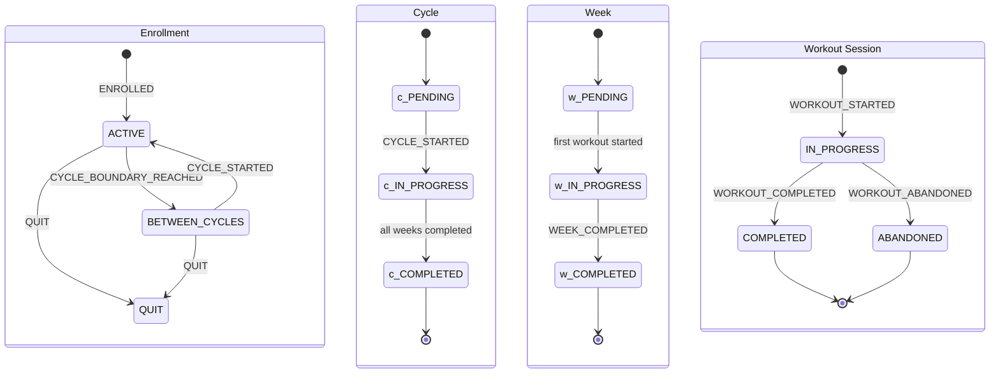

# State Machine Design Decisions

This document records the architectural decisions made during the implementation of PowerPro's workout session state machine. These decisions establish patterns for managing workout lifecycle, handling edge cases, and maintaining data consistency.

## Table of Contents

- [Workout Session Timeout](#workout-session-timeout)
- [Multiple Workouts Per Day](#multiple-workouts-per-day)
- [Backwards Compatibility](#backwards-compatibility)
- [State Transitions](#state-transitions)
- [Event Types](#event-types)

---

## Workout Session Timeout

**Decision**: Check on next workout start, mark old session as abandoned (Option B)

### Context

When a user starts a workout but never completes it (phone dies, emergency, forgets to close app), the session remains in `IN_PROGRESS` state indefinitely. We needed to decide how to handle these stale sessions.

### Options Considered

| Option | Description | Pros | Cons |
|--------|-------------|------|------|
| A | Background job with timeout | Automatic cleanup, predictable timing | Requires background infrastructure, complexity |
| B | Check on next workout start | Simple, no background jobs | Cleanup only happens on next interaction |
| C | Client-side timeout | Minimal server changes | Unreliable, client may not be running |

### Rationale

- **No background jobs needed** - Simpler infrastructure without scheduled tasks or workers
- **Abandoned sessions are rare edge cases** - Most users complete or explicitly abandon workouts
- **Users naturally self-correct** - Starting a new workout is the natural recovery action
- **Abandoned state properly recorded** - Analytics can still track abandonment patterns

### Implementation

1. When starting a new workout via `POST /workouts/start`:
   - Check for existing `IN_PROGRESS` session for the user
   - If found, return error with session ID (user must explicitly finish or abandon)
2. Explicit abandon endpoint: `POST /workouts/{id}/abandon`
   - Marks session as `ABANDONED`
   - Records abandonment timestamp
   - User can then start a new workout

### Consequences

- Users must explicitly handle abandoned sessions before starting new workouts
- No orphaned `IN_PROGRESS` sessions accumulate over time
- Clear audit trail of what happened to each session

---

## Multiple Workouts Per Day

**Decision**: Allow multiple workouts per day; `COMPLETED` status marks the canonical workout

### Context

Users may need to log multiple workout sessions for the same program day. This can happen when:
- Phone dies mid-workout and user re-attempts
- User abandons workout early due to emergency
- User wants to redo a workout they weren't happy with

### Options Considered

| Option | Description | Pros | Cons |
|--------|-------------|------|------|
| A | Only allow one session per day | Simple, unambiguous | Doesn't handle real-world edge cases |
| B | Allow multiple, COMPLETED is canonical | Flexible, handles edge cases | Slightly more complex queries |
| C | Allow multiple with explicit "primary" flag | Most flexible | Extra field to manage, user confusion |

### Rationale

- **Re-attempts are valid use cases** - Real life happens; users need flexibility
- **COMPLETED status is natural canonical marker** - No extra fields needed
- **Historical data preserved** - Abandoned attempts available for analytics
- **Aligns with state machine semantics** - Only completed workouts trigger progressions

### Implementation

1. Multiple `workout_sessions` can exist for the same `(user_id, week_number, day_index)` tuple
2. Only one `IN_PROGRESS` session allowed at a time per user (enforced at API level)
3. `COMPLETED` workouts counted for progression triggers
4. `ABANDONED` workouts tracked but do not trigger progressions
5. When querying "did user complete day X", check for any `COMPLETED` session

### Consequences

- Queries for "canonical" workout must filter by `status = 'COMPLETED'`
- Multiple completed workouts for same day are allowed (user's choice)
- Analytics can distinguish between successful and abandoned attempts

---

## Backwards Compatibility

**Decision**: Soft reference for `logged_sets.session_id` (Option A - no foreign key constraint)

### Context

Before the state machine was implemented, `logged_sets` were created with client-generated session IDs (typically UUIDs generated by the frontend). The new `workout_sessions` table introduces server-managed sessions. We needed to decide how to handle the relationship between existing logged sets and the new session tracking.

### Options Considered

| Option | Description | Pros | Cons |
|--------|-------------|------|------|
| A | Soft reference (no FK) | No migration needed, backwards compatible | No referential integrity |
| B | Backfill migration + FK | Full referential integrity | Complex migration, potential data loss |
| C | New column + deprecate old | Clean separation | Schema bloat, long transition period |

### Rationale

- **Simplest approach** - No data migration required
- **Pre-migration logged_sets preserved** - Historical data remains valid
- **No FK constraint** - Existing session_ids don't break
- **Gradual adoption** - New logged_sets can optionally reference workout_sessions.id

### Implementation

1. `logged_sets.session_id` column has no foreign key to `workout_sessions`
2. Historical session_ids (client-generated UUIDs) are preserved as-is
3. Frontend determines session_id format:
   - Legacy: Client-generated UUID
   - New: Server-provided `workout_sessions.id`
4. API accepts both formats without validation against `workout_sessions`

### Consequences

- Cannot enforce that session_id references a valid workout_session
- Must handle both legacy and new session_id formats in queries
- Analytics queries must account for orphaned session_ids

---

## State Transitions

The state machine manages four interconnected state machines for enrollment, cycles, weeks, and workout sessions.

### Enrollment State Machine

| State | Description |
|-------|-------------|
| `ACTIVE` | User is actively training in a program |
| `BETWEEN_CYCLES` | User completed a cycle, awaiting next cycle start |
| `QUIT` | User has unenrolled from the program |

**Transitions**:
- `ENROLLED` event: `[initial] -> ACTIVE`
- `CYCLE_BOUNDARY_REACHED` event: `ACTIVE -> BETWEEN_CYCLES`
- `CYCLE_STARTED` event: `BETWEEN_CYCLES -> ACTIVE`
- `QUIT` event: `ACTIVE | BETWEEN_CYCLES -> QUIT`

### Cycle State Machine

| State | Description |
|-------|-------------|
| `PENDING` | Cycle created but not started |
| `IN_PROGRESS` | Cycle is active |
| `COMPLETED` | All weeks in cycle completed |

**Transitions**:
- `CYCLE_STARTED` event: `PENDING -> IN_PROGRESS`
- All weeks completed: `IN_PROGRESS -> COMPLETED`

### Week State Machine

| State | Description |
|-------|-------------|
| `PENDING` | Week not yet started |
| `IN_PROGRESS` | At least one workout started this week |
| `COMPLETED` | All workouts for the week completed |

**Transitions**:
- First workout started: `PENDING -> IN_PROGRESS` (implicit via `WORKOUT_STARTED`)
- `WEEK_COMPLETED` event: `IN_PROGRESS -> COMPLETED`

### Workout Session State Machine

| State | Description |
|-------|-------------|
| `IN_PROGRESS` | Workout is currently active |
| `COMPLETED` | Workout finished successfully |
| `ABANDONED` | Workout was abandoned before completion |

**Transitions**:
- `WORKOUT_STARTED` event: `[initial] -> IN_PROGRESS`
- `WORKOUT_COMPLETED` event: `IN_PROGRESS -> COMPLETED`
- `WORKOUT_ABANDONED` event: `IN_PROGRESS -> ABANDONED`

---

## Event Types

The state machine emits the following events for state changes and significant actions. These events are recorded for audit purposes and can trigger side effects.

| Event | Description | Payload |
|-------|-------------|---------|
| `ENROLLED` | User enrolled in a program | `userId`, `programId`, `enrollmentId` |
| `QUIT` | User unenrolled from program | `userId`, `enrollmentId`, `reason` |
| `CYCLE_STARTED` | New training cycle began | `userId`, `cycleId`, `cycleIteration` |
| `CYCLE_BOUNDARY_REACHED` | Cycle completed, user at boundary | `userId`, `cycleId`, `cycleIteration` |
| `WEEK_STARTED` | New training week began | `userId`, `weekNumber`, `cycleIteration` |
| `WEEK_COMPLETED` | All workouts for week completed | `userId`, `weekNumber`, `cycleIteration` |
| `WORKOUT_STARTED` | User started a workout session | `userId`, `sessionId`, `weekNumber`, `dayIndex` |
| `WORKOUT_COMPLETED` | User completed a workout session | `userId`, `sessionId`, `duration` |
| `WORKOUT_ABANDONED` | User abandoned a workout session | `userId`, `sessionId`, `reason` |
| `PROGRESSION_APPLIED` | Training max was increased | `userId`, `liftId`, `previousValue`, `newValue`, `delta` |

### Event Timing

- `WEEK_STARTED` is implicit - triggered when the first workout of a week starts
- `CYCLE_STARTED` must be explicitly triggered (user confirms starting new cycle)
- `PROGRESSION_APPLIED` fires after `CYCLE_BOUNDARY_REACHED` when applicable progressions exist

### Event Ordering

Events within a single operation are emitted in dependency order:

1. `WORKOUT_COMPLETED`
2. `WEEK_COMPLETED` (if last workout of week)
3. `CYCLE_BOUNDARY_REACHED` (if last week of cycle)
4. `PROGRESSION_APPLIED` (if progressions configured)

---

## Performance Characteristics

This section documents the performance characteristics of the state machine implementation.

### O(1) Lookups

The following operations are single indexed lookups with no joins:

| Operation | Query | Index |
|-----------|-------|-------|
| Get user program state | `SELECT * FROM user_program_states WHERE user_id = ?` | UNIQUE constraint on `user_id` |
| Get workout session by ID | `SELECT * FROM workout_sessions WHERE id = ?` | Primary key |
| Check if user is enrolled | `SELECT EXISTS(SELECT 1 FROM user_program_states WHERE user_id = ?)` | UNIQUE constraint on `user_id` |

### Operations Requiring Joins

| Operation | Tables Joined | Purpose |
|-----------|---------------|---------|
| Get enrollment with program | `user_program_states` → `programs` → `cycles` | Include program name and cycle length in response |
| Get state advancement context | `user_program_states` → `programs` → `cycles` + subquery on `week_days` | Calculate days in current week for advancement logic |

These joins are necessary to avoid N+1 queries and provide complete data in a single round trip.

### Index Coverage

The following indexes support common query patterns:

| Query Pattern | Index | Migration |
|---------------|-------|-----------|
| Sessions by user state and status | `idx_workout_sessions_status (user_program_state_id, status)` | 00024 |
| Sessions by user state, week, day | `idx_workout_sessions_state_week_day (user_program_state_id, week_number, day_index)` | 00024 |
| User program state by user_id | UNIQUE constraint on `user_id` | 00010 |
| Logged sets by session | `idx_logged_sets_session (session_id)` | 00015 |
| Logged sets by user | `idx_logged_sets_user (user_id)` | 00015 |
| Logged sets by lift | `idx_logged_sets_lift (lift_id)` | 00015 |

### Event Bus Performance

The event bus uses `PublishAsync` for all state change events:

- **Non-blocking**: `PublishAsync` returns immediately without waiting for handlers
- **Goroutine-per-handler**: Each handler runs in its own goroutine
- **No API latency impact**: Handler errors don't affect API responses
- **Thread-safe**: Uses `sync.RWMutex` for handler map access

This design ensures that event publishing adds negligible latency to API responses.

### No Computed State on Read

All status fields (`enrollment_status`, `cycle_status`, `week_status`) are stored directly in the database:

- **Reads are simple column access**: No computation required at read time
- **Writes update status explicitly**: State transitions update the status columns
- **No derived state**: Status is never computed from other fields

This avoids expensive computations on every read operation.

---

## See Also

- [API Reference](../api-reference.md) - Complete endpoint documentation
- [Workflows](../workflows.md) - Common multi-step API workflows
